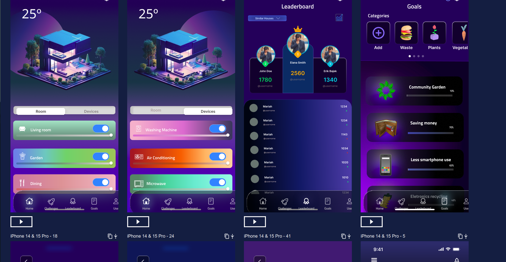

# Eco-Neighbours - IPC

Welcome to **Eco-Neighbour**! This innovative app transforms sustainability into a fun, interactive, and community-driven experience. Designed to promote eco-friendly habits, Eco-Neighbour encourages active engagement with your neighbors through exciting challenges that drive environmental awareness and positive change.

---

## 📋 Project Overview

**Goal**: Develop a novel user interface (UI) for a mobile/web app focused on sustainability, promoting eco-friendly practices and community involvement.

**Topic**: Energy and Environmental Awareness  
**Example Use Cases**:  
- Monitoring energy consumption/generation
- Helping users reduce energy consumption
- Controlling and managing smart appliances

---

## 🌟 App Features

With **Eco-Neighbour**, you can:
1. **Engage in Fun, Eco-Friendly Challenges**  
   Compete with neighbors to complete eco-friendly tasks, from recycling to conserving water and reducing energy consumption.

2. **Track Your Sustainability Score**  
   Keep tabs on your progress and compare your sustainability score with others to see who can earn the title of "Most Sustainable Home."

3. **Browse, Filter, and Input Data**  
   View and filter relevant information, input personal data to influence system status, and stay updated on your sustainability achievements.

4. **Share Eco Tips and Ideas**  
   Use the app’s social features to exchange tips, tricks, and ideas, inspiring creativity and collaboration within your community.

---

## How It Works

Eco-Neighbour provides a unique, gamified approach to sustainability:

- **Step 1**: Create an account and connect with neighbors in your area.
- **Step 2**: Browse available eco-challenges and select the ones you’re interested in.
- **Step 3**: Track your progress as you complete tasks and earn points.
- **Step 4**: Compare your score with others and work towards the “Most Sustainable Home” title.

---

## 🛠️ Project Phases

The development of Eco-Neighbour follows three main phases:

### Phase I - User and Task Analysis  
Conduct research to define user needs and specific task requirements to guide the design.

### Phase II - Lo-fi Prototype and Heuristic Evaluation  
Develop a low-fidelity prototype and perform heuristic evaluations to improve usability.

### Phase III - Hi-fi Prototype and User Evaluation  
Build a high-fidelity prototype, conduct user testing, and gather feedback for final improvements.

---

## 💡 Technology and Assumptions

- The app assumes the use of **innovative sensors** and **smart technology** for tracking energy usage, water consumption, and other metrics.
- **Creativity and innovation** are encouraged—new or hypothetical technologies may be assumed to enhance user experience.

---

## Future Development

- **Advanced Analytics**: Enable users to access in-depth insights on their consumption habits.
- **Community Events**: Introduce collaborative events to foster neighborhood-wide sustainability efforts.
- **Enhanced Social Features**: Allow for more interactive and shareable content to deepen user engagement.

---

## 📄 Documentation

Refer to the documentation for detailed user flow, wireframes, and prototype designs.

---

Thank you for checking out Eco-Neighbour! Together, let's make sustainability a shared, exciting, and impactful journey.
